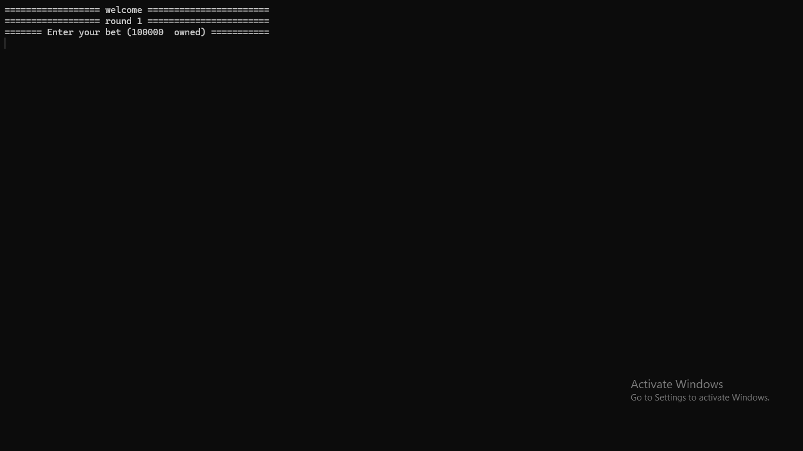
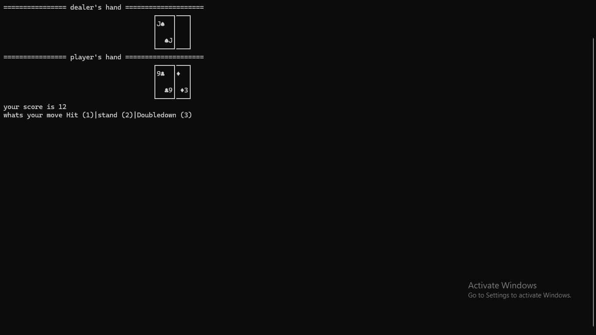
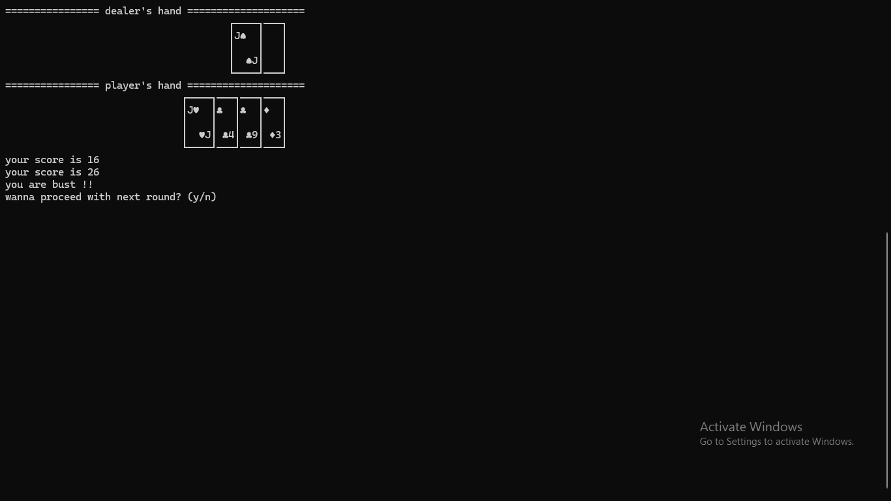
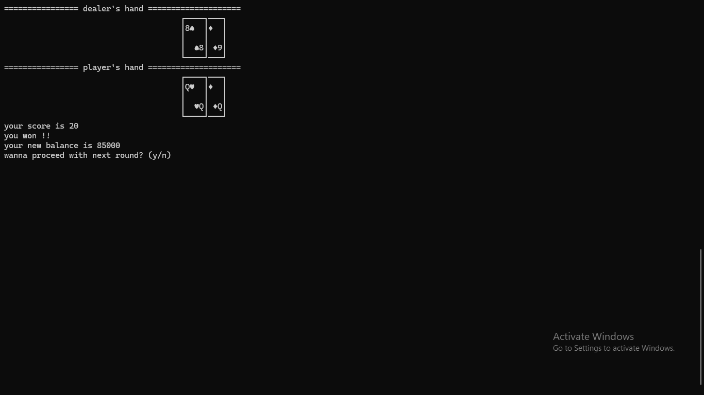
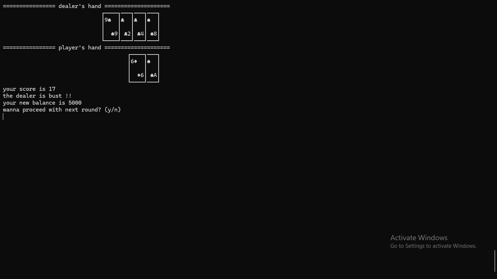
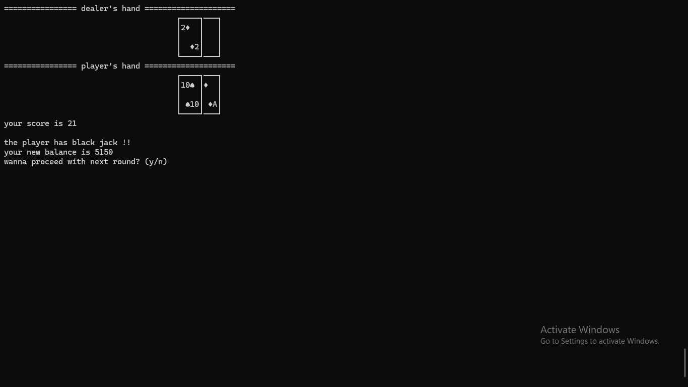

# Blackjack in C++

A terminal-based Blackjack game written in C++ featuring betting mechanics, AI dealer , and ASCII card graphics.

## Features

- Standard Blackjack gameplay
- Dealer AI
- Betting system
- Deck shuffling
- Multiple game rounds

## Project evolution

### v1.0-inital release

### v1.1-code refactor
- Separated classes into dedicated .h and .cpp files.
- Improved code organization and readability.
- Made the project easier to maintain and extend.

## Gameplay photos

<p align="center">
  
  
</p>

<p align="center">
  
  
</p>

<p align="center">
  
  
</p>
 
## Technologies

- C++
- Standard Template Library (STL)

## How to Compile

```
g++ main.cpp -o blackjack
```

## How to Run

```bash
./blackjack
```

## Author
ezz_mahdy
